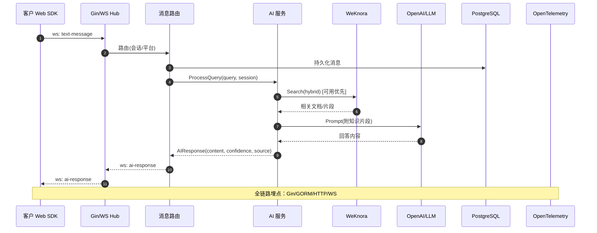
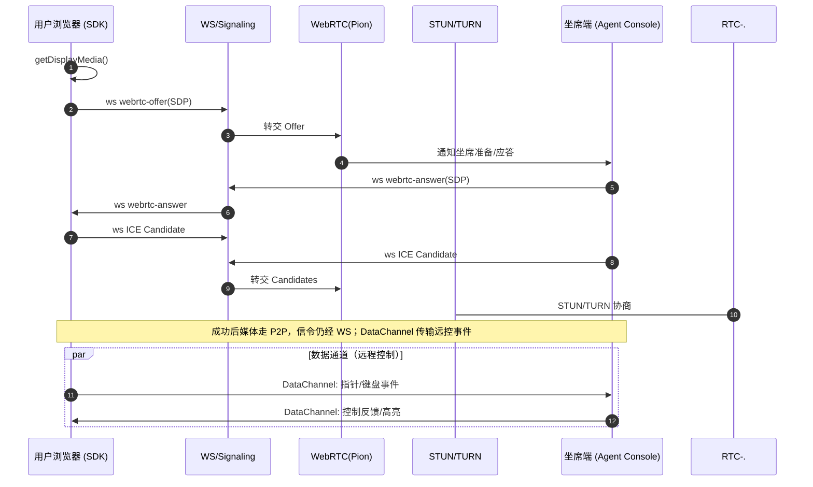
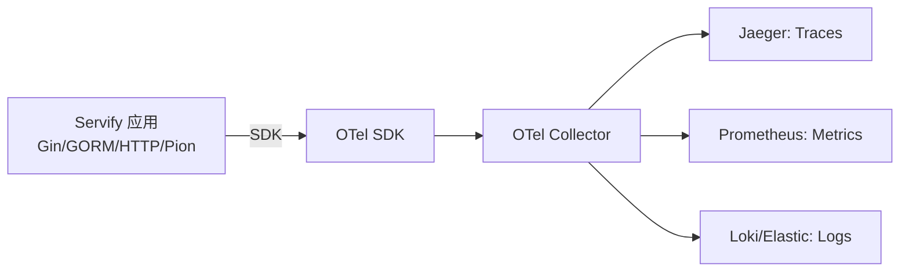

# Servify - 智能客服系统

一个基于 WebRTC 的智能客服系统，支持文字交流、AI 智能问答和远程协助功能。

## 快速开始（MVP）

- 构建与迁移
  - `make build`
  - `make migrate DB_HOST=localhost DB_PORT=5432 DB_USER=postgres DB_PASSWORD=password DB_NAME=servify`
- 运行（标准 CLI）
  - `make run-cli CONFIG=./config.yml`
- 运行（WeKnora 增强 CLI）
  - `make run-weknora CONFIG=./config.weknora.yml`
- 健康检查与端点
  - 健康: `GET /health`
  - WebSocket: `GET /api/v1/ws`（query: `session_id`）
  - AI（增强）: `POST /api/v1/ai/query`

### 生产入口说明

- 推荐以 CLI 为入口：功能完整（WS/AI/静态资源/增强路由等），并提供 `-tags weknora` 增强版
- server 入口：保留管理类 API（客户、客服、工单、统计），可通过 `--host/--port`、`DB_*`/`--dsn` 覆盖运行参数

### 配置与覆盖

- 配置文件：`config.yml` 或 `config.weknora.yml`
- 环境变量/flags 覆盖（server/migrate）：
  - 监听地址：`SERVIFY_HOST`/`--host`，`SERVIFY_PORT`/`--port`
  - 数据库：`DB_*` 或 `--dsn`
  - 测试覆盖率阈值：`TEST_COVERAGE_TARGET`（脚本 `scripts/run-tests.sh`）

### CI（自建 Runner）

- 工作流：`.github/workflows/ci.yml`（runs-on: `self-hosted`）
- Runner 搭建：`docs/CI_SELF_HOSTED.md`

### Docker Compose（WeKnora）

- `docker-compose -f infra/compose/docker-compose.yml -f infra/compose/docker-compose.weknora.yml up -d`
- 将 `config.weknora.yml` 挂载为容器内默认配置，并通过 `DB_*`/`SERVIFY_*` 覆盖运行参数

### 同步 SDK 到 Demo
- 构建并同步最新 SDK 产物到 `apps/demo-web/sdk/`：
  - `make demo-sync-sdk`
  - 或直接运行脚本：`./scripts/sync-sdk-to-demo.sh`

### 可观测性（OpenTelemetry）

- 配置（config.yml）下 `monitoring.tracing`：
```yaml
monitoring:
  tracing:
    enabled: true
    endpoint: http://localhost:4317
    insecure: true
    sample_ratio: 0.1
    service_name: servify
```
- 本地体验链路追踪：
  - `make docker-up-observ` 启动 OTel Collector + Jaeger
  - 浏览器打开 Jaeger: http://localhost:16686
  - 运行服务后访问接口，观察 Trace

### 验收清单（Smoke Test）

1) 启动（本地或 Compose）
- 本地：`make run-cli CONFIG=./config.weknora.yml` 或 `go run ./apps/server/cmd/server --host=0.0.0.0 --port=8080`
- Compose：`make docker-up-weknora`

2) 健康检查
```bash
curl -s http://localhost:8080/health | jq
```
期望：`status` 为 `healthy` 或 `degraded`

3) AI 查询（增强）
```bash
curl -s -X POST http://localhost:8080/api/v1/ai/query \
  -H 'Content-Type: application/json' \
  -d '{"query":"你好，介绍一下 Servify","session_id":"test_session_123"}' | jq
```
期望：`success: true` 并返回回答内容

4) WebSocket/RTC 状态
```bash
curl -s http://localhost:8080/api/v1/ws/stats | jq
curl -s http://localhost:8080/api/v1/webrtc/connections | jq
```
期望：`success: true`

5) 一键集成测试（WeKnora）
```bash
./scripts/test-weknora-integration.sh
```
期望：各步骤输出 ✅

6) WebSocket Web Demo（浏览器）
- 打开: http://localhost:8080/ws-demo.html
- 点击连接，输入消息，查看日志回显与 AI 回复

> 注意：消息现已落库（Message），若未配置数据库则回退日志；WeKnora 不可用时会降级到标准 AI。

### 管理后台（MVP）
- 打开: http://localhost:8080/admin/
- 功能：仪表板（平台接入、在线客服统计）、工单列表/创建、客户列表/创建、AI 状态与测试
- 说明：管理类 API 由 `apps/server` 提供，建议使用：
  - `go run ./apps/server/cmd/server --host=0.0.0.0 --port=8080`（或 `make run-cli` 的增强版本若已接入）
  - 首次使用请配置数据库并执行迁移（见上文 migrate）
 - 权限提示：
   - staff（admin/agent）：customers、agents、tickets、session-transfer、satisfaction
   - admin-only：statistics（/api/statistics/...）、sla（/api/sla/...）

### 官网（Website）
- 存放路径：`apps/website/`
- 预览方式：
  - `python3 -m http.server -d apps/website 8081`
  - 打开 http://localhost:8081
- 部署：任意静态站托管/CDN；对 `assets/**` 设置缓存头

#### Cloudflare Workers 发布（可选）
- 使用 Workers 直接托管静态资源：`apps/website-worker/`
  - wrangler.toml 已绑定 `assets.directory = "../website"`，Worker 代码会从 `apps/website/` 提供静态内容
  - 本地预览：在 `apps/website-worker` 下运行
    - `npm i`
    - `npm run dev`
  - 部署：
    - 先在本机登录：`npx wrangler login`
    - 执行：`npm run deploy`
  - SPA 路由：对于没有扩展名的路径，Worker 会回退到 `index.html`
  - CI 自动部署（push 到 `main` 时）：
    - 在 GitHub 仓库设置 Secrets：
      - `CLOUDFLARE_API_TOKEN`（具备 Workers Scripts:Edit 权限）
      - `CLOUDFLARE_ACCOUNT_ID`（Cloudflare 账户 ID）
    - 工作流 `.github/workflows/ci.yml` 的 `deploy-website-worker` job 会检测 Secrets 存在后自动执行 `wrangler deploy`
  - 健康检查与站点地图：
    - `/.well-known/healthz` 或 `/healthz` 返回 `200 ok`
    - `/sitemap.xml` 动态生成，基于请求 Host 产出 URL（无需手工改域名）

#### Cloudflare Pages 发布（可选）
- 若使用 Pages，直接部署 `apps/website` 目录：
  - CI 自动部署（push 到 `main` 时）：
    - 同样需要 `CLOUDFLARE_API_TOKEN` 和 `CLOUDFLARE_ACCOUNT_ID`
    - 可选变量：仓库 `Variables` 设置 `CF_PAGES_PROJECT`（默认值 `servify-website`）
    - 工作流 `deploy-website-pages` 会仅在 `apps/website` 变更时执行 `wrangler pages deploy`
  - 本地：
    - `make website-pages-deploy`（需要已登录 wrangler，项目名可通过 `CF_PAGES_PROJECT` 环境变量覆盖）

### 接口鉴权（JWT）
- 管理类接口（`/api/**`）默认启用 JWT 鉴权（HS256）：
  - 请求头：`Authorization: Bearer <token>`
  - 服务端密钥：`config.yml` 中 `jwt.secret`
  - 过期校验：支持 `exp/nbf/iat`（可选）
  - 上下文注入：`user_id`（若 token 携带 `user_id` 或 `sub`），`roles`（若存在）
- 角色控制：默认要求 `admin` 或 `agent` 角色
- 开发调试
  - 可在 `config.yml` 设置 `jwt.secret`，自行签发 token（HS256）
  - 示例 payload：`{"user_id":1,"roles":["admin"],"exp":<unix_ts>}`
  - 使用任意在线工具或脚本生成 HS256 JWT 并测试
  - 或使用 CLI 生成：
    - 构建 CLI：`make build-cli`
    - 生成 token：`./bin/servify-cli token --user-id 1 --roles admin,agent --ttl 120`
  - 解析/验证 token：
    - `./bin/servify-cli token-decode --token <JWT>`
    - 验证签名与时间：`./bin/servify-cli token-decode --token <JWT> --verify`（默认使用配置中的 `jwt.secret`，也可 `--secret <key>`）

### 速率限制（Rate Limiting）
- 默认启用每 IP 令牌桶限流，支持“按路径前缀”覆盖：
  - 配置项：`security.rate_limiting`（requests_per_minute、burst）
  - 按路径覆盖：`security.rate_limiting.paths`（prefix、requests_per_minute、burst、enabled）
  - Key 选择：`security.rate_limiting.key_header`（如 `X-API-Key`、`X-Forwarded-For`）
  - 白名单：`security.rate_limiting.whitelist_ips`、`security.rate_limiting.whitelist_keys`
  - 匹配策略：按配置顺序首个前缀匹配命中；未命中走全局值
  - 返回码：超过限额时返回 `429 Too Many Requests`
  - 示例：
```yaml
security:
  rate_limiting:
    enabled: true
    requests_per_minute: 60
    burst: 10
    key_header: "X-API-Key"
    whitelist_ips: ["127.0.0.1"]
    whitelist_keys: ["internal-test-key"]
    paths:
      - enabled: true
        prefix: "/api/v1/ai/query"
        requests_per_minute: 30
        burst: 10
      - enabled: true
        prefix: "/api/v1/metrics/ingest"
        requests_per_minute: 120
        burst: 30
      - enabled: true
        prefix: "/api/"
        requests_per_minute: 60
        burst: 15
```

## 系统概述

### 核心功能 (v1.0)
1. **Web 客户端 SDK** - 支持 React、Vue、原生 JS 集成
2. **AI 智能客服** - 基于知识库的智能问答系统
3. **多平台集成** - 支持微信、QQ、飞书、Telegram 等第三方平台
4. **远程协助** - 基于 WebRTC 的屏幕共享和远程控制 ⭐ *差异化优势*

### 竞争优势分析

| 功能模块 | Zendesk | Intercom | Freshworks | Servify |
|---------|---------|----------|------------|---------|
| **工单管理** | ✅ 强大 | ✅ 基础 | ✅ 完善 | 🔄 v1.1 |
| **多渠道接入** | ✅ 全面 | ✅ 主要 | ✅ 完善 | ✅ 基础 |
| **AI智能问答** | ✅ 完善 | ✅ 领先 | ✅ 基础 | ✅ 基础 |
| **知识库管理** | ✅ 完善 | ✅ 基础 | ✅ 强大 | ✅ 基础 |
| **实时聊天** | ✅ 完善 | ✅ 强大 | ✅ 完善 | ✅ 基础 |
| **远程协助** | ❌ 无 | ❌ 无 | ❌ 无 | ⭐ **创新** |
| **数据分析** | ✅ 强大 | ✅ 完善 | ✅ 完善 | 🔄 v1.2 |

**🎯 差异化定位**: 专注于需要技术支持的企业，提供独有的远程协助功能

## 技术架构

### 技术栈选择
- **后端**: Go + Pion (WebRTC) + Gin (HTTP服务)
- **前端**: TypeScript + 原生 WebRTC API
- **数据库**: PostgreSQL (pgvector) + Redis
- **AI**: OpenAI API + WeKnora (企业级知识库)
- **知识库**: WeKnora (腾讯开源 RAG 框架)
- **消息队列**: Redis/RabbitMQ

### 系统架构图（Mermaid，含 OTel/坐席/后台/监控/多租户）

```mermaid
flowchart LR
  subgraph Client[前端/终端]
    W[[Web 客户端 SDK/Widget]]
    A[[坐席控制台（Agent Console）]]
    ADM[[后台管理（Admin UI）]]
    TP[第三方渠道\nWeChat/Telegram/Feishu/QQ]
  end

  subgraph Edge[接入层]
    GIN[API Gateway\nGin + CORS + Auth]
    WS[WebSocket Hub\n会话/广播/AI 注入]
    SIG[Signaling\nWS 中继 SDP/ICE]
  end

  subgraph Core[核心服务]
    MR[消息路由\n多平台统一消息]
    PION[WebRTC 服务\nPion + DataChannel]
    AI[AI 服务\n标准/增强(WeKnora)]
  end

  subgraph Data[数据与缓存]
    PG[(PostgreSQL\npgvector)]
    R[(Redis)]
    OBJ[(对象存储\nS3/MinIO)]
  end

  subgraph Obs[可观测性]
    OTel[OpenTelemetry SDK\n(Gin/GORM/HTTP/Pion)]
    COL[OTel Collector]
    JG[Jaeger\nTraces]
    PM[Prometheus\nMetrics]
    LK[Loki/ELK\nLogs]
  end

  subgraph KB[外部知识库/AI]
    WKN[WeKnora API\n租户隔离]
    OAI[OpenAI / LLM]
  end

  subgraph RTC[打洞/中继]
    STUN[(STUN)]
    TURN[(TURN\n可选 coturn)]
  end

  W -- ws/http --> GIN
  A -- ws/http --> GIN
  ADM -- http --> GIN
  TP -- webhook/polling --> MR

  GIN -- upgrade ws --> WS
  WS --> SIG
  SIG --> PION
  PION -.-> STUN
  PION -.-> TURN

  MR <--> AI
  MR <--> PG
  MR <--> R
  AI <--> WKN
  AI --> OAI
  AI <--> PG
  GIN --> MR

  GIN ----> W
  GIN ----> A
  GIN ----> ADM

  OTel ==> COL ==> JG
  COL ==> PM
  COL ==> LK
```

#### 时序：对话 + AI


#### 时序：远程协助（屏幕共享 + 远程控制）


#### 多租户（Tenancy）
```mermaid
flowchart TB
  subgraph TenantA[租户A]
    AUI[Agent/Admin UI]
    AAPI[API 请求\n带 X-Tenant-ID]
    ADB[(Schema/DB_A)]
  end
  subgraph TenantB[租户B]
    BUI[Agent/Admin UI]
    BAPI[API 请求\n带 X-Tenant-ID]
    BDB[(Schema/DB_B)]
  end
  GIN[Gateway]
  GIN -->|Authn/Authz| AAPI
  GIN -->|Authn/Authz| BAPI
  AAPI -->|Row-level: tenant_id| ADB
  BAPI -->|Row-level: tenant_id| BDB
  note right of GIN: 策略可选\n- 独立库/Schema\n- 共享库 + tenant_id\n- WeKnora: X-Tenant-ID
```

#### 可观测性（OpenTelemetry）


### 监控与指标（Prometheus）

启用方式（config.yml）：
```yaml
monitoring:
  enabled: true
  metrics_path: /metrics
  tracing:
    enabled: true
    endpoint: http://localhost:4317
    insecure: true
    service_name: servify
```

核心指标（后端导出，前端指标通过 SDK 上报聚合后导出）：

| 指标名 | 类型 | 标签 | 说明 |
|---|---|---|---|
| `servify_info` | gauge | `version`,`commit`,`build_time` | 实例信息 |
| `servify_uptime_seconds` | counter |  | 运行时长 |
| `servify_websocket_active_connections` | gauge |  | 活跃 WS 连接数（Agent/Client 总计） |
| `servify_webrtc_connections` | gauge |  | 活跃 WebRTC PeerConnection 数量 |
| `servify_ai_requests_total` | counter |  | AI 查询总次数（标准/增强） |
| `servify_ai_weknora_usage_total` | counter |  | 走 WeKnora 的查询次数 |
| `servify_ai_fallback_usage_total` | counter |  | 走本地/降级 KB 的查询次数 |
| `servify_ai_avg_latency_seconds` | gauge |  | AI 平均耗时（秒） |
| `servify_ratelimit_dropped_total` | counter | `prefix` | 各前缀触发的 429 次数 |
| `servify_ratelimit_dropped_sum` | counter |  | 429 总次数 |
| `servify_go_goroutines` | gauge |  | goroutine 数 |
| `servify_go_mem_alloc_bytes` | gauge |  | 已分配内存（字节） |
| `servify_db_max_open_connections` | gauge |  | DB 最大连接数 |
| `servify_db_open_connections` | gauge |  | DB 当前打开连接数 |
| `servify_db_inuse_connections` | gauge |  | DB 正在使用连接数 |
| `servify_db_idle_connections` | gauge |  | DB 空闲连接数 |
| `servify_db_wait_count` | counter |  | DB 等待连接次数 |
| `servify_db_wait_duration_seconds` | counter |  | DB 等待总时长（秒） |
| `servify_db_max_idle_closed_total` | counter |  | DB 因空闲上限关闭次数 |
| `servify_db_max_lifetime_closed_total` | counter |  | DB 因生命周期关闭次数 |

建议扩展（前端 SDK/后台/坐席上报并在后端聚合导出）：

| 组件 | 指标名 | 类型 | 标签 | 说明 |
|---|---|---|---|---|
| SDK | `servify_sdk_ws_reconnects_total` | counter | `reason` | 浏览器侧重连次数 |
| SDK | `servify_sdk_messages_sent_total` | counter | `type` | 发送消息数量（text/webrtc-*） |
| SDK | `servify_sdk_messages_recv_total` | counter | `type` | 接收消息数量 |
| SDK | `servify_sdk_webrtc_sessions_total` | counter |  | 发起远程协助会话次数 |
| Agent | `servify_agent_online_gauge` | gauge | `tenant` | 在线坐席数 |
| Agent | `servify_agent_takeover_total` | counter | `reason` | 转人工次数 |
| Admin | `servify_admin_actions_total` | counter | `action` | 后台操作次数（建单/分配/关闭等） |
| Router | `servify_router_messages_total` | counter | `platform` | 统一路由消息数（web/wechat/telegram/...） |
| WebRTC | `servify_webrtc_datachannel_msgs_total` | counter | `dir` | DataChannel 消息数（up/down） |

Grafana 仪表盘建议：
- 概览：WS 活跃连接（gauge）、AI QPS（rate）、AI 平均/95/99 延迟（histogram/gauge）、WeKnora 占比、Fallback 占比（pie/bar）
- 实时通信：WebRTC 连接数、ICE 状态分布、DataChannel 消息速率（up/down）、STUN/TURN 命中率
- 坐席运营：在线坐席数、转人工趋势、工单状态分布（打开/处理中/已解决/超时）
- 渠道质量：各平台消息量 TopN、失败率、重试次数
- 系统健康：错误率、CPU/Mem/GC、Go 运行时、DB 延迟与连接池、Redis 命中率

示例查询（PromQL）：
```promql
// AI QPS
rate(servify_ai_requests_total[5m])

// AI 平均耗时（移动平均）
avg_over_time(servify_ai_avg_latency_seconds[5m])

// WS 活跃连接趋势
max_over_time(servify_websocket_active_connections[5m])

// WeKnora 占比（窗口内）
rate(servify_ai_weknora_usage_total[5m]) / rate(servify_ai_requests_total[5m])
```

## 客户端实现

### 混合架构设计
- **文本聊天**: WebSocket 连接，低延迟消息传输
- **远程协助**: 原生 WebRTC API，屏幕共享和实时通信
- **统一 SDK**: 封装复杂度，提供简洁的开发接口

### 客户端 SDK 接口
```typescript
interface ServifyClient {
  // 初始化连接
  init(config: ServifyConfig): Promise<void>
  
  // 文本消息
  sendMessage(message: string): Promise<void>
  onMessage(callback: (message: Message) => void): void
  
  // 远程协助
  startRemoteAssist(): Promise<void>
  endRemoteAssist(): void
  
  // 状态管理
  getConnectionStatus(): ConnectionStatus
  onStatusChange(callback: (status: ConnectionStatus) => void): void
}
```

### 框架集成示例
```javascript
// React Hook
const useServify = (config) => {
  const [client, setClient] = useState(null)
  const [messages, setMessages] = useState([])
  // 具体实现...
}

// Vue Composition API
const useServify = (config) => {
  const client = ref(null)
  const messages = ref([])
  // 具体实现...
}

// Vanilla JS
const servify = new ServifyClient(config)
```

## AI 智能客服

### 知识库系统
```go
type KnowledgeBase struct {
    VectorDB    *VectorDatabase // 向量数据库
    Embeddings  *EmbeddingModel // 文本向量化
    LLM         *LanguageModel  // 大语言模型
}

// RAG 流程
func (kb *KnowledgeBase) ProcessQuery(query string) (*Response, error) {
    // 1. 向量化查询
    embedding := kb.Embeddings.Embed(query)
    
    // 2. 相似度搜索
    docs := kb.VectorDB.Search(embedding, topK: 5)
    
    // 3. 构建提示词
    prompt := kb.buildPrompt(query, docs)
    
    // 4. 生成回答
    response := kb.LLM.Generate(prompt)
    
    return response, nil
}
```

### 对话管理
- 会话状态管理
- 上下文记忆
- 人工客服转接逻辑
- 智能路由决策

## 多平台集成

### 统一消息路由
```go
type MessageRouter struct {
    Adapters map[string]PlatformAdapter
    Queue    *MessageQueue
}

type PlatformAdapter interface {
    SendMessage(chatID, message string) error
    ReceiveMessage() <-chan Message
    GetPlatformType() PlatformType
}
```

### 支持平台
- 微信公众号/企业微信
- QQ 机器人
- 飞书应用
- Telegram Bot
- 钉钉机器人

## 产品路线图

### 🚀 第一阶段 (v1.0 - MVP) - 当前版本
**目标**: 完成基础智能客服功能，突出远程协助优势

- [x] 基础 WebRTC 文本通信
- [x] AI 智能问答（OpenAI 集成）
- [x] Web SDK 基础功能
- [x] 远程协助功能（屏幕共享）
- [x] 一个第三方平台集成（Telegram）
- [x] 基础知识库系统

### 🔧 第二阶段 (v1.1 - 核心增强) - 下一版本 ⚡ **包含 WeKnora 集成**
**目标**: 补充客服系统核心功能，集成企业级知识库，达到产品可用标准

#### 🎯 WeKnora 智能知识库集成 (优先级最高) ✅ **已完成**
- [x] **WeKnora 基础集成** - HTTP API 客户端，替换内存知识库
- [x] **向量数据库升级** - PostgreSQL + pgvector 扩展配置
- [x] **文档处理增强** - 支持 PDF/Word/图像文档上传和解析
- [x] **检索算法升级** - BM25 + 密集检索 + GraphRAG 混合策略
- [x] **降级与监控** - WeKnora 故障时的降级机制和健康检查

#### 🏢 客服系统核心功能 ✅ **已完成**
- [x] **工单管理系统** - 创建、分配、跟踪、关闭工单
- [x] **客户管理 (CRM)** - 客户信息、历史记录、标签管理
- [x] **人工客服接入** - 客服坐席管理、智能分配
- [x] **会话转接** - AI 到人工的无缝转接
- [x] **基础数据统计** - 会话量、解决率统计

### 📊 第三阶段 (v1.2 - 数据智能) - 后续版本
**目标**: 增强分析能力，提供商业洞察

- [ ] **数据分析面板** - 实时会话监控、客服绩效分析
- [ ] **AI 效果分析** - 回答准确率、客户满意度
- [ ] **自动化流程** - 规则引擎、触发器、工单自动分类
- [ ] **报表系统** - 可视化图表、导出功能
- [ ] **客户满意度调研** - 评分系统、反馈收集

### 🎯 第四阶段 (v1.3 - 差异化增强) - 创新版本
**目标**: 强化远程协助功能，形成竞争壁垒

- [ ] **远程协助增强** - 屏幕录制、回放、权限管理
- [ ] **多模态 AI** - 语音识别、图像识别、视频通话
- [ ] **协助会话记录** - 操作日志、问题诊断报告
- [ ] **移动端支持** - 移动远程协助、APP 集成
- [ ] **知识库智能化** - 自动更新、智能推荐

### 🏢 第五阶段 (v2.0 - 企业级) - 商业化版本
**目标**: 企业级功能，支持大规模部署

- [ ] **多租户管理** - 企业隔离、权限控制
- [ ] **API 开放平台** - 第三方集成、插件系统
- [ ] **私有化部署** - 企业内部部署、安全加固
- [ ] **高可用架构** - 负载均衡、容灾备份
- [ ] **企业级安全** - 单点登录、审计日志

### 🌟 第六阶段 (v2.1 - 生态扩展) - 平台化版本
**目标**: 构建生态系统，支持更多场景

- [ ] **行业解决方案** - 电商、金融、教育等定制化
- [ ] **插件市场** - 第三方开发者生态
- [ ] **智能营销** - 客户画像、精准推送
- [ ] **全球化支持** - 多语言、多时区
- [ ] **AI 训练平台** - 企业专属模型训练

## 技术选择理由

### 为什么选择 Go + Pion 而非 C++ + MediaSoup？

**Go + Pion 优势：**
- 开发效率高，适合快速迭代
- 天然并发支持，适合实时通信场景
- 生态完善，AI 集成便利
- 内存安全，系统稳定性好
- 跨平台编译，部署运维简单

**客户端方案：**
- 使用浏览器原生 WebRTC API
- 通过 WebSocket 处理信令
- 封装统一的 SDK 接口
- 支持多框架集成

## 市场定位与商业模式

### 🎯 目标客户
- **中小企业** - 需要性价比高的客服解决方案
- **技术型企业** - 需要远程技术支持的软件公司
- **SaaS 公司** - 需要集成客服功能的产品
- **教育机构** - 需要在线支持的培训平台

### 💰 商业模式
- **SaaS 订阅** - 按月/年收费，不同功能层级
- **私有化部署** - 一次性授权费用 + 维护费
- **API 调用** - 按调用次数计费
- **定制开发** - 行业解决方案定制服务

### 🏆 竞争优势
1. **技术架构先进** - Go + WebRTC 比传统方案更高效
2. **远程协助创新** - 主流产品缺失的差异化功能
3. **部署灵活** - 支持云端 SaaS 和私有化部署
4. **成本优势** - 开源技术栈，降低运营成本

## 快速开始

### 环境要求
- Go 1.21+
- Node.js 18+
- PostgreSQL 13+
- Redis 6+

### 本地开发
```bash
# 1. 克隆项目
git clone https://github.com/your-org/servify.git
cd servify

# 2. 配置环境变量
cp .env.example .env
# 编辑 .env 文件，配置数据库和 API 密钥

# 3. 安装依赖
go mod tidy

# 4. 运行数据库迁移（包含测试数据）
make migrate-seed

# 5. 运行服务器
make run

# 或者直接使用 go run
go run ./apps/server/cmd/server
```

### 使用 Makefile 命令
```bash
# 查看所有可用命令
make help

# 构建应用
make build

# 运行应用
make run

# 运行数据库迁移
make migrate

# 运行数据库迁移并插入测试数据
make migrate-seed

# 运行测试
make test

# 构建 Docker 镜像
make docker-build

# 使用 Docker Compose 启动
make docker-run
```

### Docker 部署
```bash
# 快速启动 (包含数据库)
docker-compose up -d

# 访问服务
curl http://localhost:8080/health
```

### 配置说明
```bash
# 必须配置项
OPENAI_API_KEY=your-openai-key    # AI 功能必需
DB_HOST=localhost                  # 数据库地址
REDIS_HOST=localhost              # Redis 地址

# 可选配置项
LOG_LEVEL=info                    # 日志级别
LOG_OUTPUT=both                   # 日志输出方式
STUN_SERVER=stun:stun.l.google.com:19302  # WebRTC STUN 服务
```

## API 文档

### 核心接口
- `GET /health` - 健康检查
- `GET /api/v1/ws` - WebSocket 连接
- `GET /api/v1/webrtc/stats` - WebRTC 统计信息
- `GET /api/v1/messages/platforms` - 平台统计
- `POST /api/v1/metrics/ingest` - 客户端/前端轻量指标上报（白名单聚合）
- `POST /api/v1/upload` - 文件上传（启用时），支持自动抽取文本与索引

#### 文件上传（/api/v1/upload）
- 说明：开启 `upload.enabled: true` 后可用；将文件保存到 `upload.storage_path`。若 `upload.auto_process: true` 则对文本类文件提取预览；若 `upload.auto_index: true` 且增强模式开启则尝试索引到 WeKnora。
- 约束：
  - 体积限制：`upload.max_file_size`（如 `10MB`、`1024`）
  - 类型白名单：`upload.allowed_types`（支持后缀 `.pdf`、`.txt` 与 MIME/前缀如 `image/*`、`*`）
- 响应字段：`filename`（保存名）、`original_name`（原名）、`size`、`extracted_text`（文本预览或占位提示）、`auto_indexed`（是否触发索引）
- 示例：
```bash
curl -F "file=@note.txt" http://localhost:8080/api/v1/upload | jq
```

### v1.1 新增 API 接口

#### 工单管理 (Tickets)
- `POST /api/tickets` - 创建工单
- `GET /api/tickets` - 获取工单列表（支持分页和过滤）
- `GET /api/tickets/{id}` - 获取工单详情
- `PUT /api/tickets/{id}` - 更新工单
- `POST /api/tickets/{id}/assign` - 分配工单给客服
- `POST /api/tickets/{id}/comments` - 添加工单评论
- `POST /api/tickets/{id}/close` - 关闭工单
- `GET /api/tickets/stats` - 获取工单统计

#### 客户管理 (Customers)
- `POST /api/customers` - 创建客户
- `GET /api/customers` - 获取客户列表（支持分页和过滤）
- `GET /api/customers/{id}` - 获取客户详情
- `PUT /api/customers/{id}` - 更新客户信息
- `GET /api/customers/{id}/activity` - 获取客户活动记录
- `POST /api/customers/{id}/notes` - 添加客户备注
- `PUT /api/customers/{id}/tags` - 更新客户标签
- `GET /api/customers/stats` - 获取客户统计

#### 客服管理 (Agents)
- `POST /api/agents` - 创建客服
- `GET /api/agents/{id}` - 获取客服详情
- `PUT /api/agents/{id}/status` - 更新客服状态
- `POST /api/agents/{id}/online` - 客服上线
- `POST /api/agents/{id}/offline` - 客服下线
- `GET /api/agents/online` - 获取在线客服列表
- `POST /api/agents/{id}/assign-session` - 分配会话给客服
- `POST /api/agents/{id}/release-session` - 释放客服的会话
- `GET /api/agents/stats` - 获取客服统计
- `GET /api/agents/find-available` - 查找可用客服

#### 会话转接 (Session Transfer)
- `POST /api/session-transfer/to-human` - 转接到人工客服
- `POST /api/session-transfer/to-agent` - 转接到指定客服
- `GET /api/session-transfer/history/{session_id}` - 获取转接历史
- `POST /api/session-transfer/process-queue` - 处理等待队列
- `POST /api/session-transfer/check-auto` - 检查自动转接

#### 数据统计 (Statistics)
- `GET /api/statistics/dashboard` - 获取仪表板统计数据
- `GET /api/statistics/time-range` - 获取时间范围统计
- `GET /api/statistics/agent-performance` - 获取客服绩效统计
- `GET /api/statistics/ticket-category` - 获取工单分类统计
- `GET /api/statistics/ticket-priority` - 获取工单优先级统计
- `GET /api/statistics/customer-source` - 获取客户来源统计
- `POST /api/statistics/update-daily` - 手动更新每日统计

### WebSocket 消息格式
```json
{
  "type": "text-message",
  "data": {
    "content": "用户消息内容"
  },
  "session_id": "session_123",
  "timestamp": "2024-01-01T12:00:00Z"
}
```

### 客户端 SDK 使用
```javascript
// 初始化客户端
const client = new ServifyClient({
  wsUrl: 'ws://localhost:8080/api/v1/ws',
  sessionId: 'your-session-id'
});

// 发送消息
client.sendMessage('你好，我需要帮助');

// 接收消息
client.onMessage((message) => {
  console.log('收到回复:', message.content);
});

// 开启远程协助
client.startRemoteAssist();
```

## 贡献指南

我们欢迎社区贡献！请查看我们的贡献指南了解详情。

### 开发规范
1. 遵循 Go 代码规范
2. 提交前运行测试: `go test ./...`
3. 提交信息格式: `feat: 添加新功能` 或 `fix: 修复问题`

### 问题反馈
- [GitHub Issues](https://github.com/your-org/servify/issues) - Bug 报告和功能请求
- [Discussions](https://github.com/your-org/servify/discussions) - 技术讨论

## 许可证

本项目采用 MIT 许可证 - 详见 [LICENSE](LICENSE) 文件

## 联系我们

- 📧 邮箱: support@servify.cloud
- 🌐 官网: [https://servify.cloud](https://servify.cloud)
- 📱 微信群: 扫码加入技术交流群

---

**⭐ 如果这个项目对你有帮助，请给我们一个 Star！**
- #### AI 增强 (WeKnora) 与上传
- `POST /api/v1/ai/query` - 智能问答
- `GET /api/v1/ai/status` - AI 服务状态（标准/增强）
- `GET /api/v1/ai/metrics` - AI 指标（增强）
- `POST /api/v1/ai/knowledge/upload` - 上传文档到 WeKnora（增强）
- `POST /api/v1/ai/knowledge/sync` - 同步传统知识库到 WeKnora（增强）
- `PUT /api/v1/ai/weknora/enable|disable` - 动态开关 WeKnora（增强）
- `POST /api/v1/ai/circuit-breaker/reset` - 重置熔断器（增强）
- #### AI 状态 (Status)
- `GET /api/v1/ai/status` 返回当前 AI 服务状态与运行信息。响应包含：
- - `type`: `standard` 或 `enhanced`（WeKnora 集成）
- - `weknora_enabled`: 是否启用了 WeKnora 集成
- - `fallback_enabled`: 是否启用了降级策略
- - `metrics`: 运行期指标（查询次数、平均耗时、WeKnora/Fallback 次数等，增强模式）
- - 当 WeKnora 启用但不可用时，将包含 `weknora_healthy=false` 与 `weknora_error` 字段
- 示例：
- ```json
- {
-   "success": true,
-   "data": {
-     "type": "enhanced",
-     "weknora_enabled": true,
-     "fallback_enabled": true,
-     "weknora_healthy": false,
-     "weknora_error": "weknora client not initialized",
-     "metrics": {
-       "query_count": 12,
-       "weknora_usage_count": 8,
-       "fallback_usage_count": 4,
-       "average_latency": 0.123
-     }
-   }
- }
- ```
- #### AI 状态 (Status)
- `GET /api/v1/ai/status` 返回当前 AI 服务状态与运行信息。响应包含：
- - `type`: `standard` 或 `enhanced`（WeKnora 集成）
- - `weknora_enabled`: 是否启用了 WeKnora 集成
- - `fallback_enabled`: 是否启用了降级策略
- - `metrics`: 运行期指标（查询次数、平均耗时、WeKnora/Fallback 次数等，增强模式）
- - 当 WeKnora 启用但不可用时，将包含 `weknora_healthy=false` 与 `weknora_error` 字段
- 示例：
- ```json
- {
-   "success": true,
-   "data": {
-     "type": "enhanced",
-     "weknora_enabled": true,
-     "fallback_enabled": true,
-     "weknora_healthy": false,
-     "weknora_error": "weknora client not initialized",
-     "metrics": {
-       "query_count": 12,
-       "weknora_usage_count": 8,
-       "fallback_usage_count": 4,
-       "average_latency": 0.123
-     }
-   }
- }
- ```
